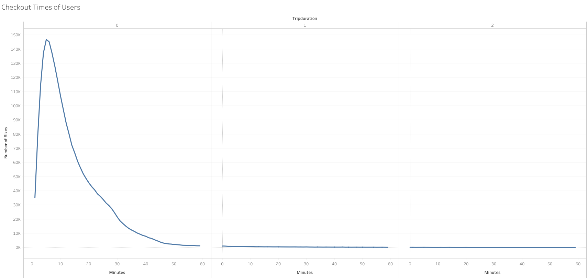
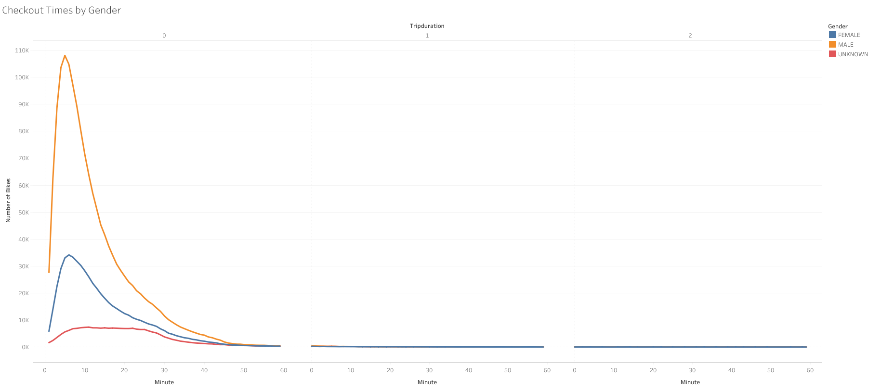
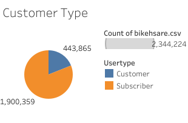
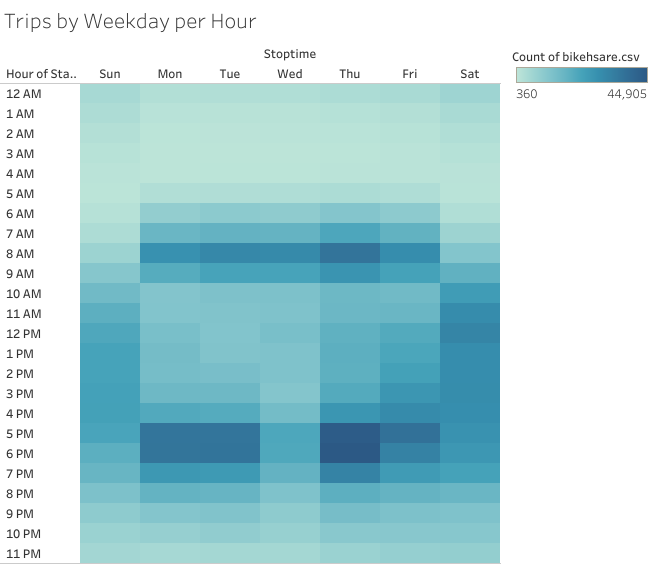
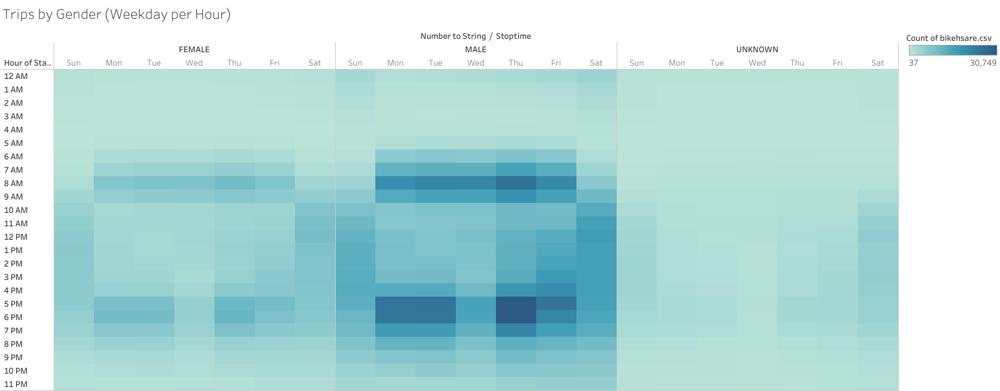
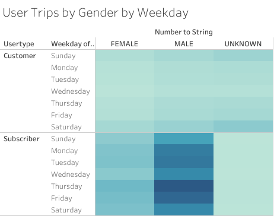
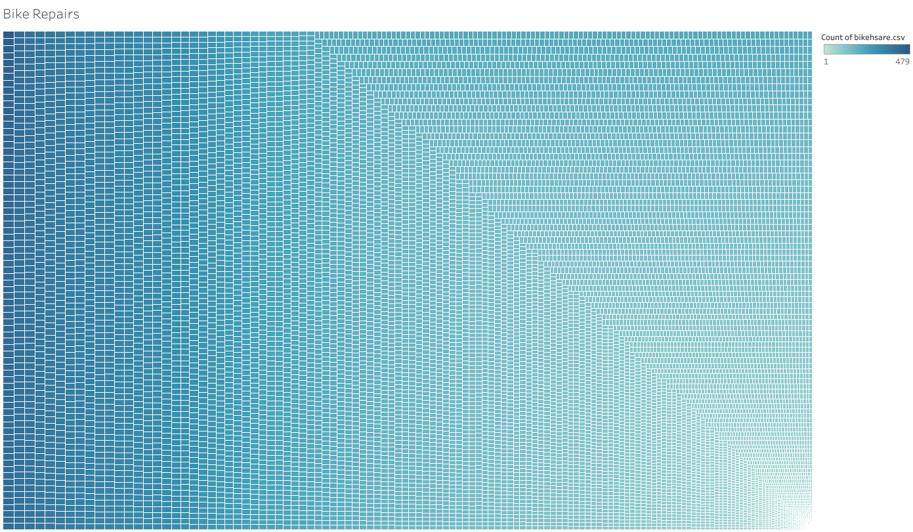
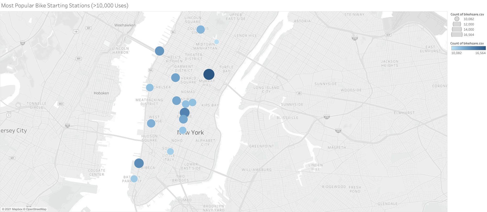
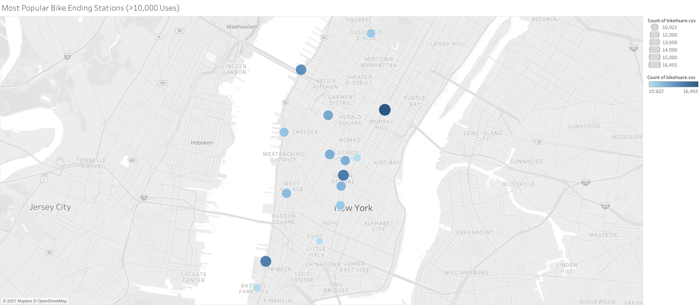

# NYC Bikesharing

## Overview

  Traffic in New York City is among the wosrt in the country. To remedy this, city residents have the option of renting bikes through a bikesharing program. There are bike stations strategically placed throughout the city where bikes can be checked out or turned back in. The results below explore data from the NYC bikesharing program from 2019. 

## Results

### Checkout Times of Users
The graph below shows the most common trip durations taken on the bikes. The graph peaks at a 5 minute trip being the most common trip taken by the people of New York. 

### Checkout Times by Gender
The graph below takes the previous infomration and breaks it down by gender. The overall shape of the graph ramains the same. 5 minute trips are the most popular. One new bit of information learned is that men are much more likely to take a bike than women. 

### Customer Type
What else can we learn about the people who use the bikes in NYC? The majority of bikeriders subscribe to the bikesharing program. At first thought it would make sense for the bikes to be used mostly by tourists, but the majority users are locals. 

### Trips by Weekday per Hour
When do the most people take the bikes? A quick glance at the chart shows that most people bike to work. The most bikes were used in the morning around 8 AM and in the evenings around 5-6 PM. Things to note are that much fewer rides are taken on Wednesday afternoons, but more people take bikes on Thursday evenings. 

### Trips by Gender
Adding a filter of gender to look at the same inforamtion from the chart above, shows again that men take more rides than women. 

### User Type of Trips by Gender by Weekday
The same information above is now broken down by the type of customers that use the bikes. This shows that the majority of riders are male, and subscibe to the bikesharing program. 

### Bike Rapairs
The following chart shows the number of times each bike is used. This will help the people who run the bikeshare program determine which bikes have been used the most and will most likely need to be serviced soon. 

## Summary

Fianlly, making modifications to the maps made in the module, the following maps show the most popular starting and ending stations across New York City. The maps are filtered on stations that are used more than 10,000 times. The larger the circle, the more times that station was used. Most of the starting and ending stations overlap with a few differences between the two. Filtering down the most popular stations to the statiosn used more than 10,000 times allows the user to see the highest used stations. Hovering over the stations on the map will show a popup with the longitude, latitude, times the station was used, and the station name. It would be important for the company to make sure that these stations are adequately equipped with bikes in both the morning and afternoon during the work week. 

[Link to Bikesharing Story](https://public.tableau.com/app/profile/john6384/viz/NYC_Bikeshare_Story/NYCBikeshareStory?publish=yes)
